# EducaJus-BR

## Project Overview

**Mission:** Educational legal assistant for Brazilian citizens and law students, focused initially on Consumer Law (CDC), prioritizing legal literacy over individualized legal advice.

**Approach:** Retrieval-Augmented Generation (RAG) grounded in official Brazilian sources (Planalto, PROCON, ANAC, CNJ), orchestrated via a multi-agent pipeline with layered guardrails to reduce hallucinations and ensure LGPD compliance.

**Target:** OAB-PR AI Hackathon (Dec 6-7, 2025).

**References:** `docs/overview_project_roadmap.md` (full implementation plan) and `docs/roadmap_mvp.md` (MVP focus).

---

## Architecture

**See [ARCHITECTURE.md](./ARCHITECTURE.md) for complete multi-agent architecture documentation.**

### Hybrid Multi-Agent System

EducaJus implements a **hybrid architecture** combining:
- **Conversational Layer** (`ConversationalAgent`): Handles user interaction, intent classification, and routing
- **Workflow Layer** (LangGraph Pipeline): Deterministic agent pipeline for educational content generation

```
User ──▶ ConversationalAgent ──▶ LangGraph Pipeline ──▶ Response
              │                    │
              │                    ├─ Triagem (PII + Scope)
              │                    ├─ Busca (RAG)
              │                    ├─ Redator (Content)
              │                    ├─ Auditor (Validation)
              │                    └─ Professor (Polish)
              │
              └─ Direct handling for greetings, clarifications, follow-ups
```

### Key Components

- **Orchestration:** LangGraph stateful graph with specialized agents
- **Backend:** Python + FastAPI (thin wrapper exposing `/api/v1/query`)
- **Prototype UI:** Gradio chat interface (ready for integration)
- **RAG:**
  - Embeddings: `sentence-transformers/paraphrase-multilingual-MiniLM-L12-v2`
  - Vector DB: FAISS (local MVP)
  - Metadata filters by source, article, date
- **LLM:** OpenAI SDK (gpt-4o-mini for classification/generation)
- **Guardrails:** Multi-layer defense:
  - **Input:** Local PII detection (regex + checksum), scope classification
  - **Processing:** Citation validation, fact-checking
  - **Output:** Readability and pedagogical quality checks
- **Privacy:** All PII detection is local; no sensitive data sent to external APIs

---

## MVP Scope (CDC-only)

From `docs/roadmap_mvp.md`:

### Goals
- **Objective:** Educational assistant explaining consumer rights with verified sources.
- **In-scope:** CDC (Lei 8.078/90) + PROCON/Senacon guides; optionally curated jurisprudence ementas.
- **Out-of-scope:** Personalized legal advice; other domains (labor, family, etc.).

### Output Format
- 30-second summary
- Practical step-by-step guidance
- Legal basis (excerpts + Planalto links)
- Quiz and glossary

### High-Level Graph (LangGraph)

```mermaid
flowchart LR
  A[Triagem & Ética] -->|clean query / block| B[RAG Busca CDC]
  B --> C[Redator Didático]
  C --> D[Auditor de Fatos]
  D -->|ok| E[Professor Quiz/Glossário]
  D -- fail --> C
  E --> F[Resposta Final]
```


### Milestones
- **M0 – Bootstrap (4h):** Repo structure, FastAPI skeleton, Gradio stub, `.env.example`
- **M1 – Data (8h):** Download/clean CDC + PROCON guides; chunk by articles; metadata (article, URL, date)
- **M2 – RAG (6h):** Embeddings + FAISS/Qdrant; search API with top-k + simple rerank
- **M3 – Graph v1 (10h):** LangGraph nodes; minimal guardrails (regex PII, citation lookup)
- **M4 – API & UI (6h):** `/api/v1/query` endpoint; Gradio chat with structured response + links + quiz
- **M5 – QA & Demo (6h):** Citation precision tests (≥95%), readability (Flesch PT >60), demo script (3 CDC scenarios)

### Timeline
48–72h hackathon sprint:
- Day 1: M0–M2
- Day 2: M3–M4
- Day 3: M5 + adjustments and demo

---

## Current Status (Oct/2025)

### Implemented ✅
- **Data Pipeline:**
  - Clean CDC text: `data/sources/cdc/cdc_clean.txt`
  - Chunked dataset: `data/sources/cdc/cdc_chunks.jsonl`
  - Provenance manifest: `data/manifests/cdc_manifest.json`
- **RAG Retrieval:**
  - FAISS index + metadata: `data/indexes/cdc_faiss/` (gitignored)
  - Retrieval helper: `packages/rag/faiss_search.py` with safety checks
  - CLI smoke test: `scripts/test_search.py`
- **Multi-Agent Architecture:**
  - **Conversational Layer:** `packages/agents/conversational_agent.py`
    - Intent classification (greeting, clarification, educational query, follow-up)
    - Context-aware conversation handling
    - Pipeline orchestration
  - **Workflow Agents:** Modular, testable agent files
    - `triagem_agent.py`: PII detection + scope classification
    - `busca_agent.py`: RAG retrieval from FAISS
    - `redator_agent.py`: Educational content generation
    - `auditor_agent.py`: Citation validation
    - `professor_agent.py`: Readability enhancement
  - **Graph Pipeline:** `packages/agents/graph_pipeline.py` (LangGraph orchestration)
- **Guardrails:**
  - `InputGuard` (`packages/guardrails/input.py`):
    - Local PII detection (CPF, CNPJ, email, phone, processo)
    - Checksum validation for Brazilian tax IDs
    - Policy-based blocking vs. warnings
  - `ScopeAgent` (`packages/guardrails/scope.py`):
    - LLM-based classification with heuristic fallback
    - CDC vs. other law vs. non-legal detection
- **Utilities:**
  - Centralized logging: `packages/utils/logging.py`
  - Demo script: `examples/conversational_demo.py`
- **Documentation:**
  - Complete architecture guide: `ARCHITECTURE.md`
  - `.gitignore`, `LICENSE`, README

### Next Steps 🚧
- **FastAPI Backend:** `apps/api/main.py` exposing `/api/v1/query`
- **Gradio UI:** `apps/web/gradio_app.py` with conversational interface
- **Enhanced Guardrails:**
  - `CitationGuard`: Validate legal references against sources
  - `StyleGuard`: Readability metrics (Flesch PT)
- **Tests:** Unit tests for each agent and integration tests for pipeline
- **LLM-Powered Redator:** Replace static templates with dynamic generation

---

## RAG Upgrade Ideas

From `docs/UPGRADE_RAG.md`:

### Recommended Enhancements
- **Explicit FAISS IDs:** Wrap index in `IndexIDMap2`, use `add_with_ids` with numeric IDs from chunk metadata to avoid positional assumptions
- **Input Validation:** Skip empty/invalid JSONL lines; require `id` and `texto`; log warnings on discards
- **Metadata Enrichment:** Persist `embedding_dim`, `num_vectors`, `normalize_embeddings`, `created_at`, `model_version` in `cdc_metadata.json`
- **Embeddings QA:** Check for non-finite values (`np.isfinite`); record encoder device/batch settings
- **Scalability Options:**
  - Switch to `IndexHNSWFlat` for larger corpora (CDC + cartilhas)
  - Consider IVF+PQ or migrate to Qdrant for payload filtering
  - Support GPU/MPS via `encode(..., device=...)`
- **Query Pipeline Alignment:** Ensure search uses same encoder + normalization as indexing; optional cross-encoder re-ranker for top-k
- **Robust Error Handling:** Clear messages for missing dependencies or files; memory guards for large datasets

### Migration Plan
1. Apply script updates and rebuild index
2. Validate retrieval quality with smoke tests
3. Integrate enhanced index into LangGraph RAG node
4. When adding cartilhas/other domains, rerun chunking + indexing
5. For larger corpora, move to HNSW or Qdrant and update retrieval adapter

---

## Quickstart

### Environment Setup
```bash
conda env create -f environment.yml
conda activate educa_jus_env

# optional: pip sync
pip install -r requirements.txt

# Set OpenAI API key (required for LLM features)
export OPENAI_API_KEY="your-key-here"
```

### Rebuild FAISS Index
```bash
python scripts/build_cdc_index.py data/sources/cdc/cdc_chunks.jsonl data/indexes/cdc_faiss
```
> **Note:** `data/indexes/` is gitignored; rebuild locally after cloning.

### Retrieval Smoke Tests
```bash
python scripts/test_search.py "direito de arrependimento em compras online" --k 5
python scripts/test_search.py "práticas abusivas" --k 5
python scripts/test_search.py "vício do produto" --k 5
```

### Run Conversational Agent Demo
```bash
python examples/conversational_demo.py
```

This demonstrates:
- Greeting handling
- Educational query processing through the full pipeline
- PII detection and blocking
- Out-of-scope query handling
- Multi-turn conversation with context

---

## Repository Layout

```
apps/
  api/            # FastAPI backend (pending)
  web/            # Gradio prototype (pending)
  workers/        # Background jobs (optional)
data/
  manifests/      # Source provenance ✅
  sources/        # Cleaned & chunked legal texts ✅
  indexes/        # FAISS artifacts (gitignored) ✅
docs/             # Roadmaps, architecture, guardrails, upgrades ✅
examples/         # Demo scripts ✅
  conversational_demo.py  # Conversational agent demo
packages/
  agents/         # Multi-agent system ✅
    conversational_agent.py  # Hybrid conversational layer
    triagem_agent.py         # PII + scope validation
    busca_agent.py           # RAG retrieval
    redator_agent.py         # Content generation
    auditor_agent.py         # Citation validation
    professor_agent.py       # Readability polish
    graph_pipeline.py        # LangGraph orchestration
  guardrails/     # Security layers ✅
    input.py      # PII detection (local, regex + checksum)
    scope.py      # Scope classification (LLM + heuristic)
    citation.py   # Citation validation (stub)
    style.py      # Readability checks (stub)
  rag/            # RAG components ✅
    faiss_search.py  # FAISS retrieval with safety checks
  utils/          # Shared utilities ✅
    logging.py    # Centralized logging configuration
scripts/          # ETL, indexing, smoke tests ✅
ARCHITECTURE.md   # Complete multi-agent architecture guide ✅
```

---

## Documentation Map — Summaries of `docs/`

### Core Planning
- **`docs/overview_project_roadmap.md`** (Backbone)
  - Comprehensive end-to-end implementation plan organized by phases:
    - Phase 0: Project setup & infrastructure
    - Phase 1: Data collection & RAG foundation (legal sources, processing pipeline, vector DB)
    - Phase 2: Multi-agent architecture (5 agents: Triagem, Busca, Redator, Auditor, Professor)
    - Phase 3: Backend API (FastAPI endpoints, background workers)
    - Phase 4: Frontend (Next.js UI, components, accessibility)
    - Phase 5: HITL system (human review queue)
    - Phase 6: Testing & QA (unit, integration, security)
    - Phase 7: Documentation (technical, user, presentation)
    - Phase 8: Deployment & demo prep
    - Phase 9: Post-hackathon roadmap (+30/+90 days)
  - Technology stack summary, success metrics (citations ≥95%, p95 < 8s, Flesch PT > 60), risk mitigation, team roles

- **`docs/roadmap_mvp.md`** (MVP Focus)
  - CDC-only scope with clear goals and limitations
  - Architecture decisions (LangGraph, FastAPI, Gradio, FAISS/Qdrant, OpenAI/LiteLLM)
  - High-level LangGraph flowchart (Mermaid diagram)
  - Milestones M0–M5 with time estimates (4h–10h each)
  - Detailed task backlog for each agent
  - Data sources (CDC, PROCON/Senacon, optional ementas)
  - Policies & guardrails (scope, LGPD, citations, tone)
  - Testing metrics and 48–72h timeline
  - Rationale for LangGraph + Gradio choice

### Technical Deep Dives
- **`docs/UPGRADE_RAG.md`** (RAG Enhancements)
  - Current state assessment (FAISS IP index, positional metadata)
  - Recommended upgrades:
    - FAISS IDMap2 for explicit ID mapping
    - Input validation and metadata enrichment
    - Embeddings QA and scalability options (HNSW, IVF+PQ, Qdrant)
    - Query pipeline alignment and re-ranking
    - Robust error handling
  - Code snippets for script updates
  - Retrieval smoke test example
  - 5-step migration plan

- **`docs/melhores_praticas_multi_agents.md`** (Multi-Agent Guardrails Best Practices)
  - Overview of multi-layered agentic guardrail pipelines
  - Defense-in-depth strategy:
    - Build unguarded agent first to observe failures
    - Implement independent layers in series
    - Layer 1: Input security (malicious prompts, PII)
    - Layer 2: Plan scrutiny (internal reasoning validation)
    - Layer 3: Output validation (fact-checking, compliance)
  - Extended 6-layer defense framework (input, reasoning, memory, tools, output, audit)
  - Performance trade-offs (50–200ms per layer; 5–15% overhead)
  - Deployment practices (dev, testing, production, maintenance phases)

- **`docs/pipeline_guard_rails.md`** (Context and Security)
  - Narrative on guardrails for legal AI in Brazil
  - Multi-layer guardrail pipeline to reduce hallucinations
  - Aegis Protocol concepts (non-forgeable identity, post-quantum encryption, zero-knowledge proofs for compliance)
  - OAB-PR Hackathon context and objectives
  - Current AI solutions in Brazilian legal market
  - Gaps and opportunities (reliability, LGPD compliance, transparency, continuous updates, access to justice)
  - Proposed "Guardrail-Br" project architecture

### MVP Refinements
- **`docs/refinamento_educa_jus_br_mvp.md`** (MVP Analysis & Refinement)
  - Why education/legal literacy focus is innovative and original
  - Alignment with OAB-PR Hackathon 2025 criteria (innovation, applicability, documentation, social impact)
  - Technical viability using guardrail references
  - RAG base knowledge strategy (limited domains, official sources, indexing approach)
  - Tooling recommendations (GPT-4 for generation, rules for validation, caching)
  - Refinement suggestions:
    - Narrow MVP scope (2-3 use cases)
    - User-friendly interface with "cartilha" mode
    - Automatic language simplicity metrics (Flesch index)
    - Evidence of impact (citations, statistics)
    - Security/LGPD details
    - Internal precision benchmarks
    - Evolution roadmap

- **`docs/educa_jus_br_mvp.md`** (MVP Concept Deck)
  - Why it's innovative (education focus, RAG with official sources, guardrails, multi-agents, HITL, accessibility)
  - Target audience (citizens, law students, professionals)
  - Agent pipeline flow (6 stages including optional HITL)
  - Concrete guardrail examples for each layer
  - Chat UX mockup (4-block response structure)
  - Prioritized RAG sources for MVP
  - Evaluation metrics (precision ≥95%, Flesch >60, NPS/CSAT, p95 <6–8s, ethical blocking rate)
  - Risks & mitigations (normative changes, LGPD false positives, expectation management, latency)
  - 5-minute demo script
  - Roadmap (hackathon → +30d → +90d)
  - Sample repo structure
  - How it scores on hackathon criteria

---

## MVP Roadmap — Tracking

- ✅ **M1 – Data:** Complete (CDC ingestion, normalization, chunking)
- ✅ **M2 – RAG:** Complete (embeddings, FAISS index, metadata, smoke tests)
- 🚧 **M3 – Graph v1:** In progress (LangGraph skeleton + basic guardrails pending)
- ⏳ **M4 – API/UI:** Upcoming (FastAPI `/api/v1/query` + Gradio chat)
- ⏳ **M5 – QA/Demo:** Planned (test scenarios, metrics validation, demo script)

See `docs/roadmap_mvp.md` for detailed milestones and timeline.

---

## Success Metrics (from overview)

### Technical
- Citation precision: ≥95% accurate
- Response time: p95 < 8s
- Readability: Flesch PT > 60
- Zero PII leakage in responses

### Hackathon Criteria
- **Innovation:** Multi-agent + guardrails + educational focus
- **Applicability:** Solves real citizen needs
- **Documentation:** Clear, open-source, reproducible
- **Social Impact:** Democratizes legal knowledge

---

## License

MIT License — see `LICENSE`.
